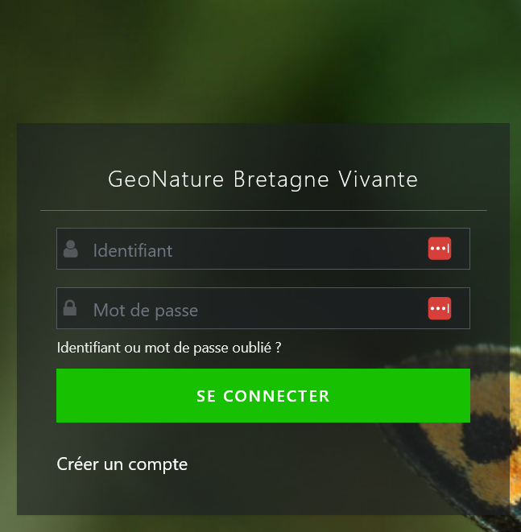
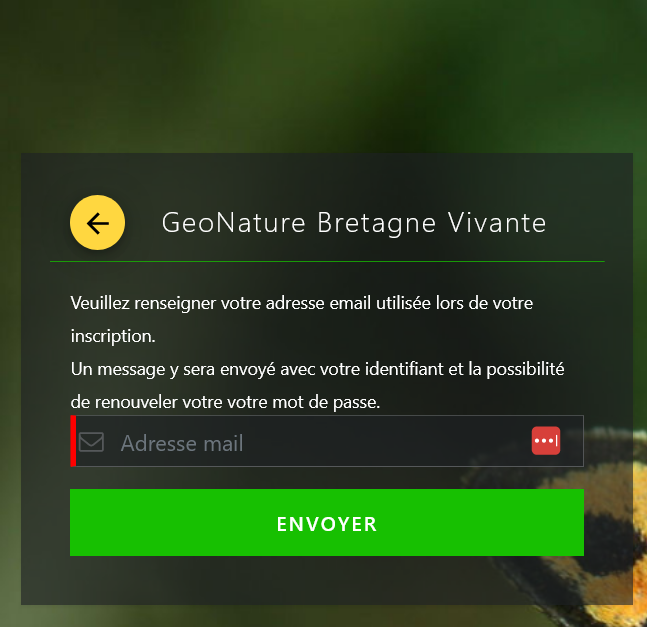

# Url geonature BV
https://geonature.bretagne-vivante.org/

# Etapes pour se connecter

## CAS 1 - Vous avez déjà un compte sur Faune Bretagne

Cliquer sur "Identifiant ou mot de passe oublié ?"
et mettre l'adresse mail que vous avez utilisé pour votre inscription sur Faune Bretagne

## CAS 2 - Vous n'avez pas de compte 

### Création d'un compte sur geonature via 
https://geonature.bretagne-vivante.org/#/login/inscription

### Attendre que la demande soit validée par un administrateur.

### 

