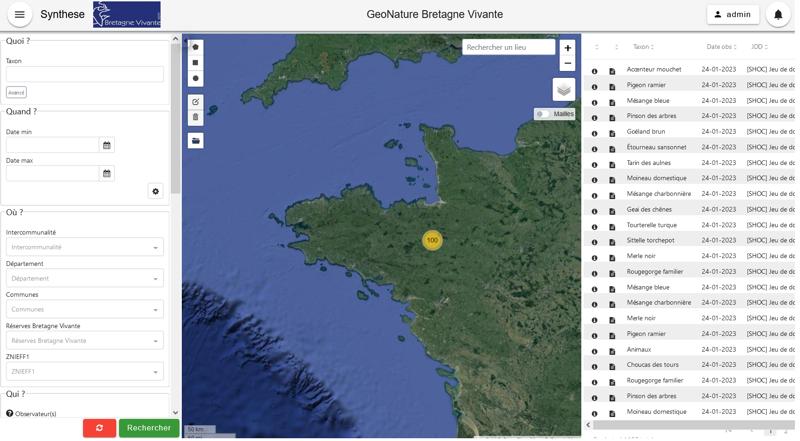

# Présentation

Bretagne Vivante a fait le choix de se doter de l'outil libre GeoNature pour la gestion de ses données naturalistes, qu'elles proviennent de SERENA, de Faune Bretagne ou d'autres fichiers épars. 

Fin 2024, l'outil de saisie de données SERENA cessera d'être géré par RNF et sera voué de fait à disparaître petit à petit dans les années qui suivront. 
Le GeoNature de Bretagne est un outil qui permet aujourd'hui la saisie de donnée. 

Depuis environ 1 an l'outil est en test auprès des salariés de Bretagne Vivante et le temps est venu de commencer à le déployer pour nos bénévoles.

Vous avez été identifiés comme bénévoles tests afin de venir explorer cet outil et vérifier qu'il corresponde bien à vos attentes en matière de bancarisation de vos données, en matière de rendu, de visualisation, etc.

Afin de vous lancer dans l'aventure, je vous invite à suivre la procédure suivante :

# Etapes pour se connecter

### Url Geonature Bretagne Vivante
https://geonature.bretagne-vivante.org/

## CAS 1 - Vous avez déjà un compte sur Faune Bretagne

Cliquer sur "Identifiant ou mot de passe oublié ?"
et mettre l'adresse mail que vous avez utilisé pour votre inscription sur Faune Bretagne
> Votre identifiant est votre adresse mail

Vous basculez automatiquement dans l'organisme "Bénévoles Bretagne Vivante",
afin de vous permettre d'accéder aux jeux de données ouverts à la saisie publique.

Vous n'avez pas la possibilité de voir les observations ne vous appartenant pas. 

## CAS 2 - Vous n'avez pas de compte 

### Création d'un compte sur geonature via :
https://geonature.bretagne-vivante.org/#/login/inscription

> merci de mettre votre adresse mail comme identifiant  

### Attendre que la demande soit validée par un administrateur.
La validation est manuelle donc merci de patienter, 
si la demande est faite un week-end le compte sera validé le lundi. 

## CAS 3 - Vous êtes un partenaire (associatif ou institutionnel) 
Vous souhaitez récupérer ou saisir des données.
Vous devez créer un compte.  
votre adresse mail doit être votre adresse mail professionnelle, une vérification pourra être demandée afin d'éviter les usurpations d'identité.

Le champs organisme est en texte libre et donc a titre indicatif, 
un référent vous associera manuellement avec votre organisme afin que vous ayez les droits hérités de votre organisme (export de vos données ou saisie d'observations).

### Recommendations Mot de passe
Il est conseillé d'utiliser un mot de passe sécurisé avec les caractéristiques suivantes :

### Se connecter via la page de login
https://geonature.bretagne-vivante.org/#/login

## Export de données
### Aller sur le module Synthese

https://geonature.bretagne-vivante.org/#/synthese

### Manuel utilisateur synthese
https://docs.geonature.fr/user-manual.html#synthese

## Saisie de données
### Aller sur le module OccTax

Via le menu, aller sur l'onglet OccTax.

https://geonature.bretagne-vivante.org/#/occtax

### Manuel utilisateur occtax
https://docs.geonature.fr/user-manual.html#occtax

## Utilisation de occtax via votre mobile

Voir [ tuto installation_application_mobile](https://bretagne-vivante.github.io/geonature/installation_application_mobile.html)

# Contact

Les relais techniques pour vous seront : 
- Emmanuelle Pfaff - emmanuelle.pfaff@bretagne-vivante.org
- Pierre Le Dorze - pierre.ledorze@bretagne-vivante.org

En cas d'erreur, merci de les contacter en priorité pour toute question 
en joignant un screen de l'erreur et le contexte